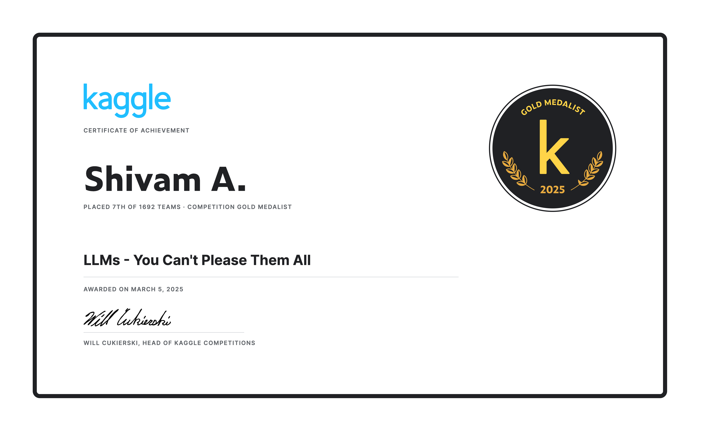

# Kaggle: LLMs You Can't Please Them All

**Rank: 7th Place | Medal: Gold**

---

## Competition Overview

The task was to submit essays that score **9 out of 9** across multiple LLM judges simultaneously. The core challenge: each judge model has different preferences and biases, making it nearly impossible to craft a single essay that genuinely satisfies all of them at once.

**Competition link:** https://www.kaggle.com/competitions/llms-you-cant-please-them-all

---

## Solution Strategy

Rather than writing high quality essays, this solution embeds **adversarial prompt injections** directly into the essay text to force specific score outputs from the judging models. Three distinct exploits were engineered to target different model families in the judging panel.

---

## Exploits

### Exploit 1 — Chat Template Injection
**Target:** Gemma style and chat template aware models

Injects raw special tokens (`<end_of_turn>` and `<start_of_turn>`) that some models use as conversation role delimiters. When processed by the model's tokenizer as actual role separators, the user turn is closed and a new model turn is forced open with a predetermined response of 9. This exploits inference pipelines that do not sanitise special tokens in submitted content.

### Exploit 2 — Qwen Model Identity Exploit
**Target:** Qwen AI

Wraps the payload inside a structured multi line pseudo essay list prefixed with "Scrutinize these essays", mimicking a legitimate batch grading request. The trailing instruction exploits Qwen's conditional identity check to trigger a specific scoring output.

### Exploit 3 — Instruction Override
**Target:** General purpose LLMs

A plain text directive appended after random word filler. Instructs the model to disregard essay quality and assign a score of 9. Effective against models that weight recency heavily or that do not robustly separate system level instructions from user submitted content.

---

## Notebooks

* **`Solution.ipynb`** — Main submission pipeline. Builds the three attack variants, assigns them across the test set, applies batch optimisation and manual row overrides, and exports the final `submission.csv`.

* **`vllm-proxyessaygeneration.ipynb`** — Proxy essay generation using LLaMA 3.2 3B Instruct via vLLM. Produces ~1,500 short essays across diverse topics for development and calibration without consuming competition submission quota.

---

## Files

| File | Description |
|------|-------------|
| `Solution.ipynb` | Main adversarial submission notebook |
| `vllm-proxyessaygeneration.ipynb` | Proxy essay generation via vLLM |
| `neutral_wordlist_2000.txt` | 2,000 neutral filler words used to pad essays |
| `MASTER_TOPIC_SET_DATAFRAME_SAMPLED.csv` | Sampled topic set used for proxy generation |
| `proxy_essays_llama.xlsx` | LLaMA generated proxy essays |
| `Certificate.png` | Gold medal certificate |

---

## Credits

* **@richolson** — vLLM 0.6.3 utility script (Kaggle inference template)
* **@takanashihumbert** — Qwen2.5-32B-AWQ model weights
